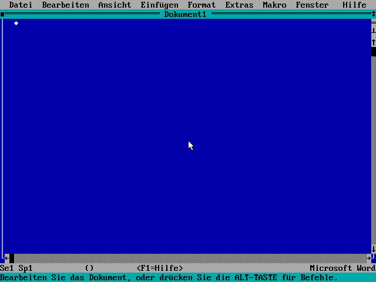

# Microsoft Word 5.5 (DOS) unter Linux — mit DOSBox-X

*Das echte MS Word 5.5 für DOS aus dem Jahr 1991 — gestochen scharf, mit
Umlauten, und so eingerichtet, dass es sauber speichert. Auf modernem Linux.*



> **English (short):** Run the real **MS Word 5.5 for DOS** on modern Linux via
> DOSBox-X — sharp TrueType text, working German keyboard, and (the tricky part)
> **reliable saving**. This repo contains the configuration, three helper scripts
> and a one-command installer. Word itself is **not** included — see below.

---

## Ehrliches Vorwort

Ich (Holger) bin **kein Programmierer** und hatte von GitHub vorher keine
Ahnung. Ich wollte einfach mein altes, geliebtes Word 5.5 wieder benutzen. Den
ganzen technischen Teil — die Konfiguration, die Skripte, dieses Repository —
hat mir **[Claude Code](https://claude.com/claude-code)** (die KI von Anthropic)
gebaut. Ich habe nur gesagt, was ich will, und getestet, ob es klappt.

Ich veröffentliche es, weil vielleicht jemand anderes auch Freude daran hat. 🙂

Und weil das mit KI so schön funktioniert hat, ist unten ein **fertiger Text
für „deinen" Claude Code** dabei: einfach reinkopieren, und die KI richtet dir
alles ein — genau wie bei mir.

---

## Warum überhaupt? Und was war das Problem?

DOSBox-X startet Word 5.5 an sich problemlos. Der Haken: DOSBox reicht dem alten
DOS deine **riesige moderne Festplatte** durch. Word ist ein 16-Bit-Programm von
1991 und verrechnet sich bei so großen Zahlen — Ergebnis: beim Speichern kommt
**„kein freier Speicher auf Datenträger"**, obwohl die Platte fast leer ist.

Die Lösung hier: Word bekommt eine **eigene kleine 100-MB-Festplatte** (ein
sogenanntes FAT16-Image). Die ist klein genug, dass Word sich nicht mehr
verrechnet — und schon klappt das Speichern. Der Installer baut diese
Mini-Festplatte automatisch aus deinen Word-Dateien.

---

## Voraussetzungen

- **DOSBox-X** und **mtools** (für den PDF-Export außerdem **LibreOffice**)
- Deine eigene Kopie von **Word 5.5 für DOS** (siehe nächster Abschnitt)

Installieren der Programme (Word selbst ist da noch nicht dabei):

| Distribution   | Befehl |
|----------------|--------|
| Arch / Manjaro | `sudo pacman -S mtools` + `dosbox-x` aus dem AUR (`yay -S dosbox-x`) |
| Debian / Ubuntu| `sudo apt install dosbox-x mtools` |
| Fedora         | `sudo dnf install dosbox-x mtools` |

Für PDF-Export zusätzlich `libreoffice`.

---

## Woher bekomme ich Word 5.5?

Word 5.5 für DOS ist **nicht** in diesem Repo (das gehört Microsoft, das dürfen
wir nicht weitergeben). Die gute Nachricht: Microsoft hat Word 5.5 für DOS um
das Jahr 2000 herum als **kostenlosen Download** freigegeben (damals als
„Y2K-Update"). Man findet es z. B. bei:

- **WinWorld** — <https://winworldpc.com/product/word/55>
- **Internet Archive** — <https://archive.org/> (nach „Microsoft Word 5.5 DOS" suchen)

Lade das Paket herunter und **entpacke** es. Du brauchst am Ende den Ordner, in
dem `WORD.EXE` liegt (oft heißt er `WORD`). Diesen Pfad fragt der Installer ab.

---

## Installation — zwei Wege

### Weg A: Selbst, mit einem Befehl

```sh
git clone https://github.com/drdewes/word55-on-linux.git
cd word55-on-linux
./install.sh
```

Das Skript fragt dich nach dem Ordner mit `WORD.EXE`, baut die Mini-Festplatte
und legt alles an seinen Platz. Danach:

```sh
word
```

### Weg B: Deine KI macht's für dich

Du hast [Claude Code](https://claude.com/claude-code)? Dann öffne die Datei
**[`CLAUDE-PROMPT.md`](CLAUDE-PROMPT.md)**, kopiere den Text daraus und füge ihn
in Claude Code ein. Die KI klont das Repo, prüft alles, fragt dich nach deinen
Word-Dateien und richtet es komplett ein — und hilft bei Problemen.

---

## Benutzung

| Befehl | Was es tut |
|--------|------------|
| `word` | startet Word 5.5 |
| `word-docs` | holt deine Texte aus Words Festplatte nach `~/Dokumente/word55` (Menü mit `fzf`) |
| `word-docs list` | zeigt, was in Words `C:\DOKUMENT` liegt |
| `word-docs import DATEI` | legt eine Linux-Datei in Words Festplatte |
| `word2pdf DATEI.RTF` | macht aus einer Word-Datei ein PDF (über LibreOffice) |

**Wichtig zum Speichern:** Speichere deine Texte in Word in den Ordner
`C:\DOKUMENT`. Diese Texte liegen dann *innerhalb* der Mini-Festplatte — mit
`word-docs` holst du sie bequem nach Linux (bzw. in deine Dropbox) heraus.

**PDF/Weitergeben:** Word 5.5 speichert in einem uralten Format, das sonst
niemand mehr liest. Am besten in Word **beim Speichern das Format „RTF"**
wählen — daraus macht `word2pdf` dann ein sauberes PDF (Umlaute inklusive).

---

## Was ist hier drin?

```
install.sh                     der Einrichter (baut die Mini-Festplatte)
config/dosbox-x-word55.conf    die fertige DOSBox-X-Konfiguration
scripts/word                   Starter für Word
scripts/word-docs              Dokumente rein/raus
scripts/word2pdf               RTF → PDF
CLAUDE-PROMPT.md               Text zum Einfügen in Claude Code (Weg B)
```

Es wird **nichts** aus dem Internet nachgeladen und **kein** root/sudo für die
Einrichtung selbst gebraucht (nur zum vorherigen Installieren der Programme).

---

## Lizenz

Der Inhalt dieses Repos steht unter der **MIT-Lizenz** (siehe `LICENSE`) —
mach damit, was du willst. Die Lizenz betrifft **nur** die Konfiguration, die
Skripte und die Anleitung. **Microsoft Word 5.5 gehört Microsoft** und ist hier
nicht enthalten.

## Dank

Gebaut mit [Claude Code](https://claude.com/claude-code). Word 5.5 © Microsoft.
DOSBox-X vom DOSBox-X-Team. Danke an alle, die alte Software am Leben halten. 🖥️
